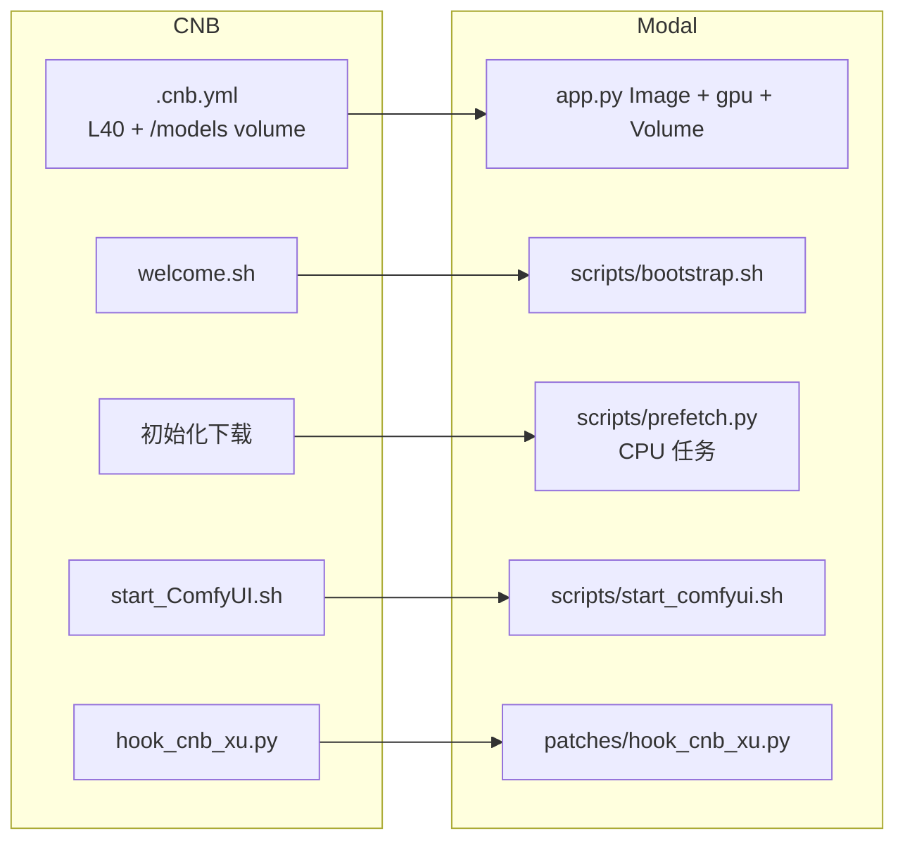

# Modal 部署：绽知 ComfyUI（CNB 做法的对应实现）

这套脚本把 [zhan_zhi/ComfyUI](https://cnb.cool/zhan_zhi/ComfyUI) 在 CNB 上的启动模型，一对一映射到 [Modal](https://modal.com)，并且**不把 CNB 仓库里的冗余层再抄一份进来**。

CNB 真正在做的事只有四层：

1. 预装 CUDA / Python / Torch 的镜像  
2. 启动时浅克隆仓库（ComfyUI + 插件 + 工作流）  
3. 把模型写进持久卷 `/models`  
4. 先开 Web UI，后台按 `初始化下载` 预取；工作流缺模型时再按 `source.json` 现下  

本仓库只实现这四层在 Modal 上的等价物。下面这些 **CNB 专有、在 Modal 上有害或重复** 的东西故意没有搬过来：

| CNB | 为什么不搬 |
| --- | --- |
| `.cnb.yml` + vscode「起飞」按钮 | Modal 用 `modal serve` / `modal deploy` |
| `docker.cnb.cool/...-zh:v1.6` | Modal 构建机到不了 CNB 私有仓库；改用公开 CUDA 13 镜像 + cu130 的 Torch |
| `venv312`（Git LFS 里的整棵虚拟环境） | 依赖装进 Modal Image，避免几十 GB 冗余 |
| `welcome.sh` 里的 code-server、阿里云 pip、交互式显存询问、`fix_hydra.enc` | Modal 容器没有这套 IDE；镜像构建时源已经选定 |
| `start_ComfyUI.sh --cache-none` | 那是 **共享 L40** 策略；Modal 的 GPU 是独占计费，应把模型留在显存里 |
| 五份历史 `start_ComfyUI*.sh` | 只留 `scripts/start_comfyui.sh` |
| `git_push.sh` / `switch_cnb_yaml.sh` | 代码在本 Git 仓库；GPU 用 `MODAL_GPU` |
| `extra_model_paths.yaml` **再加** `ComfyUI/models -> /models` | CNB 扫了两遍同一棵树；这里只保留软链 |
| 把 `source.json` / `初始化下载` 复制进本仓库 | 运行时从绽知仓库读取，避免和上游漂移 |

上游 ComfyUI、74 个插件、107 个工作流 **仍然来自绽知仓库**，由 `scripts/clone_cnb.sh` 在镜像构建时浅克隆：`--depth 1` + `blob:none`（先只拉 tree），再按目录 / 每个 custom node 分片 `sparse-checkout add`，HTTP/1.1 + 失败重试。不拉 LFS，也不物化 `venv312` / `models`。

## 对应关系



| CNB | Modal |
| --- | --- |
| 点「ComfyUI 起飞」 | `modal serve app.py` 或 `modal deploy app.py` |
| runner tag `gpu:L40` | `MODAL_GPU=L40S`（Modal 上最接近的 48GB 卡；可换成 `A100-80GB` / `H100`） |
| `volumes: [/models]` | Volume `zhanzhi-comfy-models` → `/models` |
| 工作流 / 输入 / 输出写在 workspace | Volume `zhanzhi-comfy-data` → `/workspace/data` |
| 启动后后台 `nohup 初始化下载` | UI 里同样后台预取；**也可以先 CPU 跑** `modal run app.py --action prefetch`，不占 GPU |
| `source.json` 下拉框里能看到还没下载的模型 | 同一套 hook，写入 `/models` |
| `assets/source_2.json` 用户覆盖 | `config/source_2.json`（本仓库）+ 克隆来的 `assets/source_2.json` |

## 目录

```
app.py                 Modal App（镜像、Volume、UI、prefetch）
scripts/clone_cnb.sh   浅克隆绽知仓库：depth=1、blob:none、按插件分片、HTTP/1.1 重试
scripts/bootstrap.sh   布局软链 + hook + 后台预取 + 启动
scripts/start_comfyui.sh
scripts/prefetch.py    解析并执行「初始化下载」
scripts/apply_hook.py  安装 hook（绽知树已打过补丁则只拷文件）
patches/catalog.py     唯一的目录/URL 合并逻辑
patches/hook_cnb_xu.py 保持 CNB 的四个函数名，路径改为 MODELS_ROOT
config/source_2.json   你自己的模型覆盖（不要把上游 source.json 贴进来）
config/prefetch.extra.sh
```

## 使用

```bash
pip install -r requirements.txt
modal setup

# 1) （推荐）先在 CPU 上把「初始化下载」写进 Volume，避免 GPU 空转
modal run app.py --action prefetch

# 2) 开发：临时 URL，改脚本会热重载
modal serve app.py

# 3) 持久地址
modal deploy app.py

# 看 Volume 里已经有多少模型
modal run app.py --action status
```

第一次 `serve` / `deploy` 会构建镜像：拉 CUDA 13 基础镜像、用 Modal 的 `Image.uv_pip_install`（uv，比 pip 快）装 Torch 2.9.0+cu130、浅克隆绽知仓库、再用 `uv pip` 装 ComfyUI 与插件的 `requirements.txt`。这对应 CNB 预装镜像，只需要做一次。需要 Modal Python SDK **≥ 1.1.0**。

换卡：

```bash
MODAL_GPU=H100 modal deploy app.py
```

只更新绽知仓库里的插件/工作流：改 `CNB_REPO_REF` 后重新 deploy（镜像层会重克隆）。不要把那 50GB+ 的 Git LFS 推进本仓库。

### 环境变量

见 `.env.example`。常用：

- `MODAL_GPU` — 默认 `L40S`
- `CNB_REPO_URL` / `CNB_REPO_REF` — 绽知仓库；可换成你自己的 fork / GitHub 镜像
- `CNB_CLONE_RETRIES` — 每个分片 fetch 失败后的重试次数，默认 `5`（Modal 构建机访问 `cnb.cool` 容易 HTTP/2 断流）
- `MODAL_BAKE_CNB=0` — 镜像里不克隆，容器启动时再克隆（冷启动更慢，镜像更小）
- `PREFETCH=0` — UI 启动时不要后台预取（你已经跑过 `prefetch` 时很有用）
- `COMFY_EXTRA_ARGS` — 追加给 `main.py`，例如 `--use-flash-attention`
- `MODAL_SECRETS` — 默认挂载 Modal Secret `huggingface`、`civitai`、`github`（提供 `HF_TOKEN` / `CIVITAI_TOKEN` / `GITHUB_TOKEN`）
- `TORCH_INDEX_URL` — 默认 cu130；若驱动不够新，可改 `https://download.pytorch.org/whl/cu128`

### 自己的模型

1. 把文件直接 `modal volume put` 进 `zhanzhi-comfy-models` 的对应子目录；或  
2. 在 `config/source_2.json` 按 CNB 格式加 `{ "checkpoints": { "foo.safetensors": "https://..." } }`，工作流选中时会现下到 Volume。

不必再跑 CNB 的 `web_editor.py`。

预取进度（UI 容器里）：

```text
tail -f /tmp/prefetch.log
```

这就是 CNB 文档里 `tail -f /tmp/初始化下载.log` 的对应物。

## 设计约束

- **模型不进镜像、不进本 Git 仓库。** 只进 Volume。  
- **Python 环境不进 Git。** 只进 Image；镜像层用 `uv_pip_install` / `uv pip`，不用 pip。  
- **绽知的 `source.json` / `初始化下载` 不 fork 一份。** 克隆后原地读。  
- **启动脚本只有一份**，按独占 GPU 调 VRAM，而不是按 CNB 共享卡。  
- Hook 继续叫 `hook_cnb_xu.py`，因为绽知的 `folder_paths.py` 已经 `import hook_cnb_xu`。

## 测试

```bash
pip install -r requirements-dev.txt
pytest -q
```

不需要 GPU，也不需要 Modal 账号。测的是目录解析、覆盖合并、预取 dry-run。

## 限制

- Modal 构建机必须能访问 `cnb.cool`（克隆 + 下 LFS 模型 URL）。若被墙，把 `CNB_REPO_URL` 换成镜像，并把 `source_2.json` 改成 Hugging Face 地址。  
- SageAttention / flash-attn 没有默认编进镜像（CNB 自己也说 flash-attn 很难装）。需要时自行加进 Image 或 `COMFY_EXTRA_ARGS`。  
- 部分插件的 `requirements.txt` 在镜像构建时是 best-effort，冲突不会让整镜像失败；缺依赖时看 Modal 日志再补。  
- ComfyUI Manager 在运行时新装的插件写在镜像层，容器回收即消失。要把插件固化，请改绽知 fork 后重构建，或自行把 `custom_nodes` 挂到 Volume。
